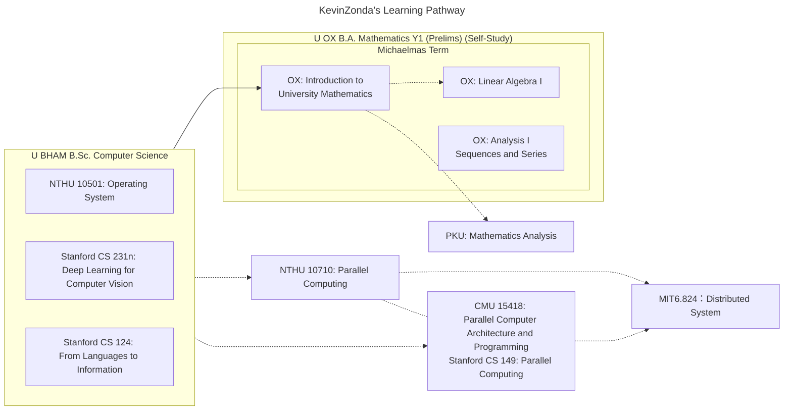

> Every time we do get something we reduce by a measurable amount the opportunity to get that something in the future, until ultimately the time will come when there will be no more "getting."  
> ── *LINDSAY, R. B. (1959). ENTROPY CONSUMPTION AND VALUES IN PHYSICAL SCIENCE. American Scientist*

Some links:
[GitHub](https://github.com/KevinZonda)
[Website](https://KevinZonda.com)
[Twitter](https://twitter.com/toncoin_cn)
[Telegram](https://t.me/KevinZonda)

## About Me

- I just finished my undergraduate at the _University of Birmingham_ with _B.Sc. Computer Science with Hornours, **Class I**_, **GPA 4.25, Weighted Overall 77.625%**.
- I previously worked as **_CPO @ Limit-LAB_** and _Architect & Dev @ Treehollow_.
- I have _understanding_ and _experience_ on **_Go_** and **C#**. I also work with _Java_, _Python_, _C_, _Powershell_, etc.
- I also have _experience_ on _RDBMS_ (e.g. **_MySQL_** and **_PostgreSQL_**) and _NoSQL_ (e.g. **_Redis_**).
  and am current doing _Cassandra_ and _MongoDB_ with _gorm_
- I speak **_Mandarin (zh-CN)_**, **_British English (en-GB)_**, _Chinglish (en-CN)_ and fairly little _Cantonese (zh-HK)_
- I can't _html_, _css_ and _JavaScript_, I feel sorry about this (but can do a little **_TypeScript_**)
- I use **_GoLand_**, **_Rider_**, **_Visual Studio_**, **WebStorm**, _IDEA_, _CLion_ & _QtCreator_ as my IDEs, and **_git_** as VCS
- I use **_macOS arm64_**, _Windows 10 LSTC x64_, _Fedora x64_, _Debian x64_, _Ubuntu x64/arm64_ ~~and _Manjaro x64_~~ as my system environment ~~, BTW, I don't use Arch~~.
- I prefer thinner items, therefore business laptops would have higher probability to be chosen. I work with
  ~~_ThinkPad X1 Yoga Gen 6_~~ (broken 4 times in 1 year, retired), **_MacBook
  Air 2022 (M2)_**, **_DELL XPS 13 9370_**, _Lenovo Yoga Slim 7 Pro (14'' AMD)_ ~~and _MSI GS66 2020_ (retired)~~ (Ordered by frequency
  of use)

## My Interest

- Machine Learning & Deep Learning
- Programming Language Theory
- Other: interested at _Mathematics_, _Public Health_ and _Epidemiology_, may try to get _MPH/PGDip/PGCert_ degree after finishing CS courses

## Some badges

## My Current Learning Pathway

## Contact Me

Please feel free to contact me with any kind of following ways:

- [Email: realkevin{AT}tutanota.com](mailto:realkevin@tutanota.com) as _Primary Personal Email_
- [Email: hi{AT}kevinzonda.com](mailto:hi@kevinzonda.com) as _Domain Personal Email_
- [Email: kevin{AT}limit.dev](mailto:kevin@limit.dev) if you want to talk about _limit.dev_, for _Work Purpose Only_
- [Email: ******{AT}student.bham.ac.uk]() for _Academical Purpose Only_
- [Telegram@KevinZondaGroup](https://t.me/KevinZondaGroup)
