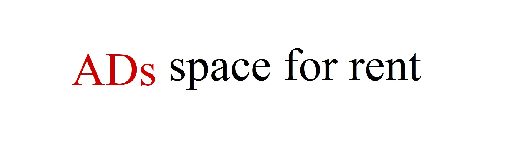

<!--<div align="center">
  
</div> -->

<!--
```plain
  _  __                 _              _____                          _                  
 | |/ /                (_)            / ____|                        | |                 
 | ' /    ___  __   __  _   _ __     | (___     __ _   _ __     ___  | |__     ___   ____
 |  <    / _ \ \ \ / / | | | '_ \     \___ \   / _` | | '_ \   / __| | '_ \   / _ \ |_  /
 | . \  |  __/  \ V /  | | | | | |    ____) | | (_| | | | | | | (__  | | | | |  __/  / / 
 |_|\_\  \___|   \_/   |_| |_| |_|   |_____/   \__,_| |_| |_|  \___| |_| |_|  \___| /___|
```
-->

<!---->

<!--
-->
<p align="center">
</img>
</p>

### 👋 Hi there! Here is Laurel Merton's GitHub. A foundation student who wants to learn computer.
### 👨‍🎓 Till now, I still cannot master any programming skill. If you want, could you teach me some? I really wanna learn it! Thank you!
<!-- ### Now I'm focusing on developing [FastGit](https://fastgit.org) which provides the high-speed github acceleration service. -->

[](mailto:kevin@fastgit.org)
[](mailto:kevin@v2fly.org)
[](mailto:realkevin@tutanota.com)
[](https://twitter.com/emptyMethod)
[](https://t.me/LaurelMerton)
[](https://fastgit.org)
[](https://passcore.org)
[](https://github.com/KevinZonda?tab=followers)
[](https://t.me/fastgit)


<!--[](https://github.com/KevinZonda)-->
<!--[](https://twitter.com/emptyMethod)-->
---

**Proudly develop with ❤️ and .NET**

<!--
[](https://www.microsoft.com/en-gb/download/internet-explorer.aspx)


-->
<!--
**KevinZonda/KevinZonda** is a ✨ _special_ ✨ repository because its `README.md` (this file) appears on your GitHub profile.

Here are some ideas to get you started:

- 🔭 I’m currently working on ...
- 🌱 I’m currently learning ...
- 👯 I’m looking to collaborate on ...
- 🤔 I’m looking for help with ...
- 💬 Ask me about ...
- 📫 How to reach me: ...
- 😄 Pronouns: ...
- ⚡ Fun fact: ...
-->
