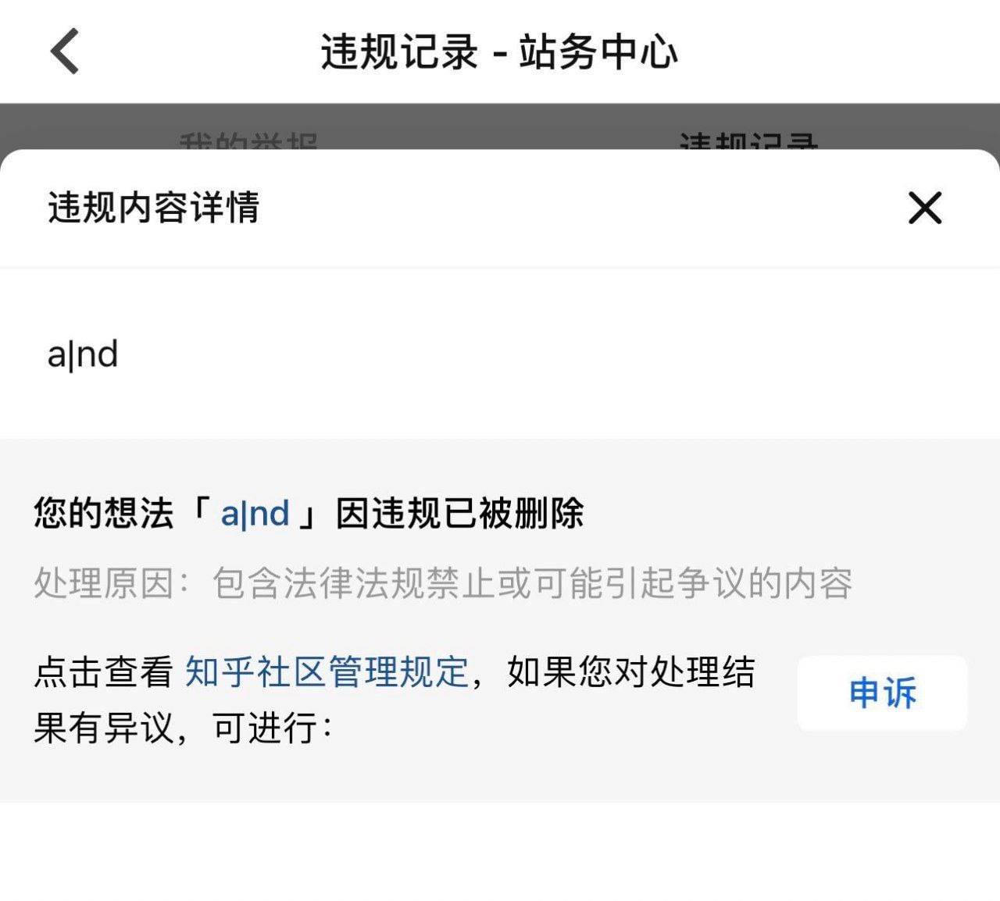

> **哦，我的上帝，你看看这作业，你看看这代码，哦，我向圣母玛利亚发誓，我从未见过如此 NB 的代码，哦我的老天爷，这真是活见鬼，真是见了\*\*活的鬼**

> Every time we do get something we reduce by a measurable amount the opportunity to get that something in the future, until ultimately the time will come when there will be no more "getting."  
> ── *LINDSAY, R. B. (1959). ENTROPY CONSUMPTION AND VALUES IN PHYSICAL SCIENCE. American Scientist*

<https://github.com/KevinZonda>  
<https://KevinZonda.com>  
<https://twitter.com/FailedWaste>  
<https://t.me/KevinZonda>

学术乞丐，皇家鸽舞团成员，擅长学术坟墓中坟头蹦迪。  
精神 Kevin 壬。  
说胡话警告 ⚠。  
高考语文数学不及格，英语正好及格线，物理化学都刚刚好，以至于没学上。  
不要问我英文好不好，雅思 5.5。  
编程也就图一乐，收收心找个电子厂上班了。  
GPA 0/100 (or 0.0/4.3), Rank last 5% ([Maths&Logic](https://www.cs.bham.ac.uk/internal/modules/2021/06-35324/) Rank 404/404, [OOP](https://www.cs.bham.ac.uk/internal/modules/2021/06-34229/) Rank 452/452, [DSA](https://www.cs.bham.ac.uk/internal/modules/2021/06-30175/) Rank 450/450).  
精神法国人（`sudo rm -fR /`）

---

<code>an|d</code>

</img>

<!--

关于弘扬民族传统文化禁止过洋节的通知

</img>

关于新冠高危风险地区的紧急医疗事件处理方法

</img>

-->

[基于物联网大数据的海平面高度与沿海地区健美操教学](https://link.springer.com/article/10.1007/s12517-021-07748-2)

大学也就图一乐，学真知识还得靠带专。

有人能给我个Debian的激活码吗？破解工具用不了

只要 GitHub 无人使用，那么 GitHub 就不会宕机

子非燕雀，安知燕雀不知鸿鹄之志[^1]

我喜欢你，我们贴贴吧！

我是傻逼，请给我打钱

Coding = Copying + Paraphrasing = Plagiarising

PCR + IgM + Isolation as a Service.

Anti-vaxxers are terrorism.

[^1]: 抄袭自 StudentMain https://github.com/studentmain/studentmain/blob/ffaeff405cb88bf482c8428fdfeecb37b572b8df/README.md?plain=1#L18
